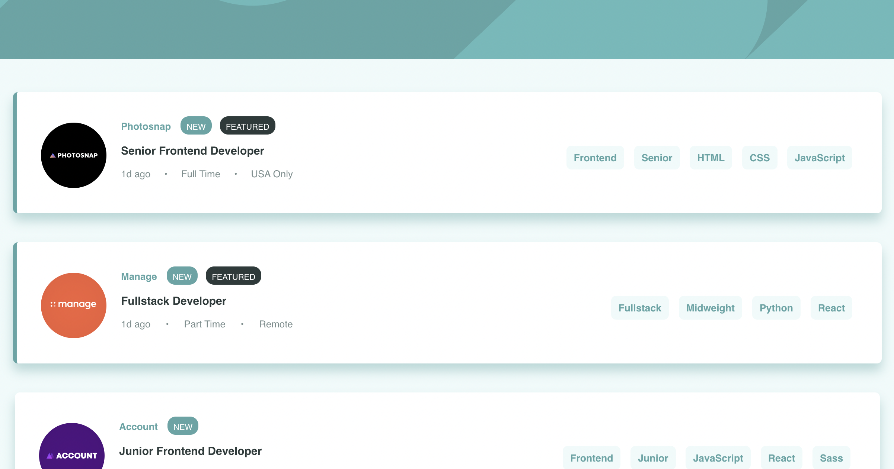

# Frontend Mentor - Job listings with filtering solution

This is a solution to the [Job listings with filtering challenge on Frontend Mentor](https://www.frontendmentor.io/challenges/job-listings-with-filtering-ivstIPCt). Frontend Mentor challenges help you improve your coding skills by building realistic projects. 

## Table of contents

- [Overview](#overview)
  - [The challenge](#the-challenge)
  - [Screenshot](#screenshot)
  - [Links](#links)
- [My process](#my-process)
  - [Built with](#built-with)
  - [What I learned](#what-i-learned)
  - [Continued development](#continued-development)
  - [Useful resources](#useful-resources)
- [Author](#author)
- [Acknowledgments](#acknowledgments)

## Overview

### The challenge

Users should be able to:

- View the optimal layout for the site depending on their device's screen size
- See hover states for all interactive elements on the page
- Filter job listings based on the categories

### Screenshot



### Links

- Solution URL: [Github Repo](https://github.com/da9104/react-jobboard)
- Live Site URL: [Demo](https://da9104.github.io/react-jobboard)

## My process

### Built with

- Semantic HTML5 markup
- CSS custom properties
- Flexbox
- CSS Grid
- Mobile-first workflow
- [React](https://reactjs.org/) - JS library
- [gh-pages](https://docs.github.com/en/pages) - Deploying to Github pages
- [Styled Components](https://styled-components.com/) - For styles

### What I learned

- Optimising the usage of Style-Component for react components such as using Theming.
- Implementing Object.keys and Object.entries function 
- Filtered the data using the `filter` function to display only the relevant records from the dataset.

```javascript
 {Object.entries(filters).map(filter => {
      const fieldName = filter[0] 
          if (Array.isArray(filter[1])) {
              return filter[1].map(filter => <FilterItem key={uuidv4()} filters={filters} filter={filter} setFilters={setFilters} fieldName={fieldName} />)
                  }
          return <FilterItem key={uuidv4()} filters={filters} filter={filter[1]} setFilters={setFilters} fieldName={fieldName}/>
                })  }
```

### Useful resources

- [Front End Mentor](https://www.frontendmentor.io) - This web site helped me for a strong front-end understanding.

## Author

- Website - [Dami K](https://www.your-site.com)

## Acknowledgments

This is where you can give a hat tip to anyone who helped you out on this project. Perhaps you worked in a team or got some inspiration from someone else's solution. This is the perfect place to give them some credit.

